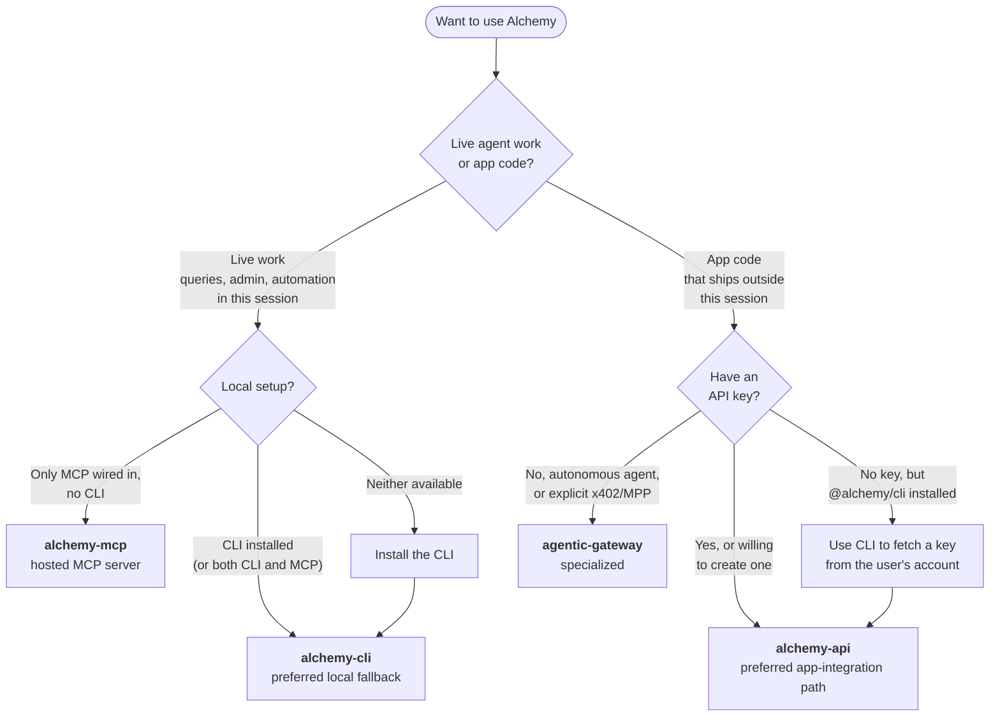

# Alchemy Skills

Agent Skills for using [Alchemy](https://www.alchemy.com/) — both for **live agent work** done in the current session (one-off queries, admin, automation) and for **wiring Alchemy into application code** that ships.

## Decision tree

Pick the right skill in two questions:



### 1. Live agent work, or app code?

- **Live agent work** = the agent runs a query, admin command, or local automation **right now in this session**. The result is consumed in the conversation, not deployed as code.
- **App code integration** = the agent wires Alchemy into application code (server, backend, dApp, worker, script) that runs **outside** this agent session.

### 2. Route based on local environment / auth

| What you're doing | Use this skill |
| --- | --- |
| **Live agent work** + `@alchemy/cli` is installed locally | `alchemy-cli` (preferred local fallback) |
| **Live agent work** + both `@alchemy/cli` and an MCP server are available | `alchemy-cli` (CLI is preferred when both are available) |
| **Live agent work** + only an MCP server is wired into the client (no CLI) | `alchemy-mcp` |
| **Live agent work** + neither is available | install `@alchemy/cli` (`npm i -g @alchemy/cli`), then use `alchemy-cli` |
| **App code** + you have or can create an Alchemy API key | `alchemy-api` (preferred app-integration path) |
| **App code** + no API key in env, **but** `@alchemy/cli` is installed locally | `alchemy-api` after using the CLI to fetch a key (`alchemy auth login` → `alchemy apps select` → `alchemy --reveal config get api-key`) |
| **App code** + no API key, autonomous agent paying per-request, or you explicitly want x402/MPP | `agentic-gateway` (specialized) |

Each skill self-routes — its `When to use this skill` / `When to use a different skill` sections will redirect you if you land on the wrong one.

The Alchemy CLI is the **preferred local fallback runtime path** for live agent work. The MCP server is the preferred runtime path for AI clients only when the CLI is not installed.

## Skills

### `skills/alchemy-cli`

Live agent skill for the local `@alchemy/cli`. Maps every Alchemy product (Node, Token, NFT, Transfers, Prices, Portfolio, Simulation, Solana, Webhooks, Apps) to `alchemy <command>` invocations with structured JSON output.

- **Auth**: CLI manages auth internally (browser login, API key, access key, x402 wallet)
- **Setup**: `npm i -g @alchemy/cli`, then `alchemy auth login`
- **Entry point**: [`skills/alchemy-cli/SKILL.md`](skills/alchemy-cli/SKILL.md)

### `skills/alchemy-mcp`

Live agent skill for the hosted Alchemy MCP server (`https://mcp.alchemy.com/mcp`). Exposes 159 tools across 100+ chains. OAuth flow handled by the client; no API key or local install required.

- **Auth**: OAuth (sign in with Alchemy account when prompted by your MCP client)
- **Setup**: add the server to your MCP client (Claude Code, Codex, Cursor, Claude Desktop, VS Code Copilot)
- **Entry point**: [`skills/alchemy-mcp/SKILL.md`](skills/alchemy-mcp/SKILL.md)

### `skills/alchemy-api`

App-integration skill for wiring Alchemy into application code that ships, using a standard API key. Covers the full Alchemy surface: EVM JSON-RPC, WebSockets, Token, NFT, Transfers, Prices, Portfolio, Simulation, Webhooks, Solana, Solana Yellowstone gRPC, Sui gRPC, Wallets/Account Kit, and operational topics.

- **Auth**: API key in URL or header
- **Setup**: create a free key at [dashboard.alchemy.com](https://dashboard.alchemy.com/)
- **Entry point**: [`skills/alchemy-api/SKILL.md`](skills/alchemy-api/SKILL.md)

### `skills/agentic-gateway`

Specialized app-integration skill for app code without an API key. Uses Alchemy's gateway with wallet-based auth (SIWE for EVM, SIWS for Solana) and per-request payments (USDC via x402, or USDC/credit-card via MPP).

- **Auth**: SIWE/SIWS token + payment (x402 or MPP)
- **Protocols**: x402 (`@alchemy/x402` + `@x402/fetch` or `@x402/axios`) or MPP (`mppx`)
- **Setup**: generate a wallet, fund it with USDC (or use Stripe via MPP)
- **Entry point**: [`skills/agentic-gateway/SKILL.md`](skills/agentic-gateway/SKILL.md)

## Installation

### Install the CLI directly (recommended for live agent work)

```bash
npm i -g @alchemy/cli
alchemy auth login
```

### Install the skills bundle

```bash
npx skills add alchemyplatform/skills --yes
```

Each source skill is self-contained and includes:

- `SKILL.md`
- `LICENSE.txt`
- `agents/openai.yaml` metadata for agent ecosystems that support it

## Specification

These skills follow the [Agent Skills specification](https://agentskills.io/specification). See [spec/agent-skills-spec.md](spec/agent-skills-spec.md) for details.

## Official links

- [Developer docs](https://www.alchemy.com/docs)
- [Get Started guide](https://www.alchemy.com/docs/get-started)
- [Create a free API key](https://dashboard.alchemy.com/)
- [Install the Alchemy CLI](https://www.npmjs.com/package/@alchemy/cli)
- [Hosted MCP server](https://mcp.alchemy.com/mcp)

## License

MIT
